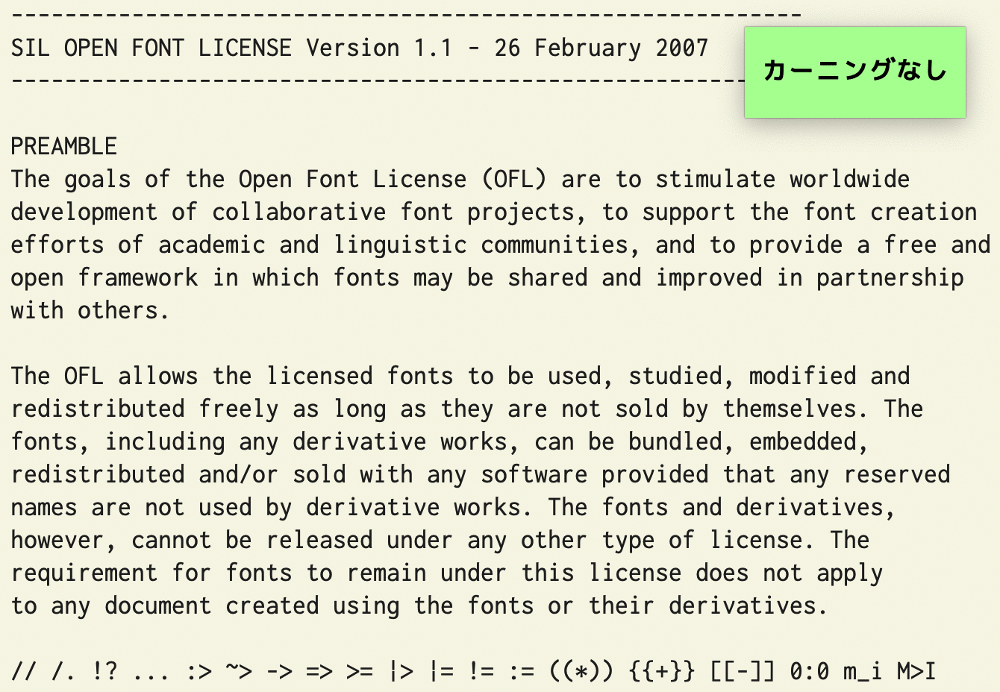
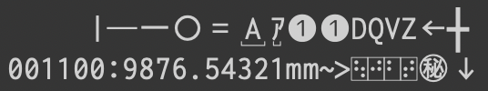

# 全角英数や半角カナが判別しやすい、文字間隔調整機能付き等幅フォント「Cyroit」

Cyroit (しろいと) はプログラミングにもお使いいただける日本語等幅フォントです。  
プログラミング向け合成フォントとして評価の高い [ricty](https://rictyfonts.github.io) の生成スクリプトで遊んでいるうちに、フォント製作の沼にはまってしまったために誕生しました。  
全角英数記号や半角カナ等にアンダーラインが引いてあるため、全角・半角の組み合わせになっている括弧や、誤って使われている全角チルダなどをすぐに見つけることができます。  
全角スペースや半角・ノーブレークスペースを可視化したバージョンも用意してあり、使い分けて使用できます。  

[Commit Mono](https://commitmono.com) に影響を受け、calt フィーチャを利用したカーニング機能を実装しました (v1.1.0以降)。  
[mottainaiDTP](http://mottainaidtp.seesaa.net) さんの [3桁ごとにカンマが発生するフォント](http://mottainaidtp.seesaa.net/article/395328634.html) を応用して、桁区切り表示に対応したバージョンを追加しました (v1.6.0以降)。  
スタイルセットに対応したことで、機能や見た目について柔軟な対応ができるようになりました (v2.0.0以降)。

## フォントサンプル  

[CotEditor](https://coteditor.com) にて  
  

[warp](https://www.warp.dev) + [Starship](https://starship.rs/ja-JP/) + [lsd](https://github.com/lsd-rs/lsd) にて  
  

[egword Universal2](https://www.monokakido.jp/ja/mac/egworduniversal2/) にて  
  

カーニングサンプル  
  

桁区切り表示サンプル  
  

## ダウンロード

最新版 (v2.0.0)
- [フォント](https://github.com/omonomo/Cyroit/releases/download/v2.0.0/Cyroit_v2.0.0.zip)
- [ソースコード](https://github.com/omonomo/Cyroit/archive/refs/tags/v2.0.0.zip)

フォントファイルの使用は自己責任にてお願いいたします。  
ファイルを使用することで生じた不具合・損害等について omonomo は責任を負いません。  

## その他の特徴

- 主にラテン文字のグリフは [Inconsolata](https://github.com/googlefonts/Inconsolata) を使用しています。
- 主に仮名文字、ギリシア文字、キリル文字のグリフは [CircleM+ 1m](https://mix-mplus-ipa.osdn.jp) を使用しています。
- 主に漢字のグリフは [BIZ UDゴシック](https://github.com/googlefonts/morisawa-biz-ud-gothic) を使用しています。
- [Nerd Fonts](https://www.nerdfonts.com) Ver.3 を追加しています。
- [ricty_generator](https://rictyfonts.github.io) を Fork したスクリプトで自動生成させています。生成時にグリフの改変や調整を行っています。

### ラテン文字について

- 小文字の g をオープンテールに改変しています。
- アスタリスクのスポークを6本に増やしています。
- チルダの波が強調されています。
- 数字の7の先端を折り曲げています。
- その他のグリフについても、視認性向上や他の素材フォントとのバランスをとるための微調整を施しています。

### 仮名文字について

- 一部のひらがなを教科書体っぽく (跳ねたり突き抜けたり別れたり) しています。
- 濁点、半濁点の大きさや位置を変更しています。
- イコールと区別しやすいようにダブルハイフンの先端を少し折っています。
- その他のグリフについても、他の素材フォントとのバランスをとるための微調整を施しています。

### 漢字について

- カタカナや図形の○などと区別しやすいように一部の漢字にウロコを追加しています。
- いわゆる土吉 (吉の異体字) を追加しています。
- その他のグリフについても、他の素材フォントとのバランスをとるための微調整を施しています。

### 記号類について

- 形状の似た記号と区別しやすいように破線に改変している記号があります。
- キーボードショートカット用などの記号を少し追加しています。

### 機能的なものについて

- IVS を利用した漢字の異体字表示に対応しています。
- ccmp によるアイヌ語カナ表記に対応しています。
- vert のみですが、縦書き表示に対応しています。
- calt を利用して、等幅のままでラテン文字 (一部除く) の文字間隔を調整するようにしています。
- 同じく calt を利用して整数に桁区切りマークを表示させています。また桁区切り表示版は小数が少し小さく表示されます。
- 桁区切りマークは、上の表示が4桁区切り (36桁まで)、下の表示が3桁区切り (39桁まで) になります。4桁区切りは0と1が続いた時のみ表示されます。
- 通常版に限りますが、各 ss を有効にすることで機能や見た目をカスタマイズすることができます。
- 記号を置き換えるタイプのリガチャには対応していません。
- 素材元のフォントにあった GSUB、GPOS のフィーチャは大幅に削ってあります。

## 収録フォントの違い

見た目が少し違うだけなのに種類を増やしたため、無駄にファイルサイズが大きくなってしまい大変申しわけございません。  
それぞれにレギュラー、オブリーク、ボールド、ボールドオブリークの書体が含まれています。  

|   名称   | サンプル | 説明 |
|----------|----------|------|
| Cyroit   |  | 通常版。スタイルセット対応。内容については後述。 |
| CyroitBS |  | 基本版。Ver.1.x.x までの通常版。全角スペースを可視化しています。 |
| CyroitSP |  | スペシャルスペース版。半角スペース、ノーブレークスペースも可視化したバージョン。 |
| CyroitDG |  | 桁区切り表示付き版。たくさん並んだ数字とにらめっこする時間を短縮できます。 |
| CyroitFX |  | 文字間隔固定版。calt と相性が悪いソフト用。 |
| CyroitHB |  | 平凡版。全てのスペースが不可視でグリフ改変も抑えたバージョン。プリントアウト用にどうぞ。 |

### 通常版のスタイルセットについて

スタイルセットの設定方法については、[Fira Code](https://github.com/tonsky/FiraCode) の[説明](https://github.com/tonsky/FiraCode/wiki/How-to-enable-stylistic-sets)が分かりやすいと思います。

| タグ名 | サンプル | 内容 |
|--------|----------|------|
|  ss01  |  | 全角スペース可視化 |
|  ss02  |  | 半角スペース可視化 |
|  ss03  |  | 3桁区切りマーク表示 |
|  ss04  |  | 4桁区切りマーク表示 |
|  ss05  |  | 小数小文字化 |
|  ss06  |  | 全角・半角形の下線消去 |
|  ss07  |  | 識別性向上グリフ無効化 |
|  ss08  |  | ストローク付き DVZ 有効化|

## ライセンス

- フォントのライセンス : [SIL Open Font License 1.1](build/OFL.txt)
- スクリプトのライセンス : [MIT](./LICENSE.txt)

素材元のフォントやスクリプトはライセンスが異なる場合があります。  

## 生成スクリプトの使い方

### ビルド環境

Cyroit は、以下の環境でビルドできることを確認しています。  

- OS: macOS Sonoma (version 14.2)
- Shell: zsh 5.9 (x86_64-apple-darwin23.0)
- FontForge: 20230101
- FontTools: 4.47.0

### 実行方法

あらかじめ、パッケージマネージャ等を利用して [FontForge](https://fontforge.org/en-US/) と [FontTools](https://github.com/fonttools/fonttools) をインストールし、使える状態にしておいてください。  

スクリプトのある場所をカレントディレクトリにして  
```
./run_ff_ttx.sh -F
```
異常なく完了した場合、直下の build フォルダにフォントが保存されます。  

### 各スクリプトの説明

Cyroit の生成には5つの Shell スクリプトを使用します。  

**`run_ff_ttx.sh`**

一連の処理を自動化します。  
`-F` オプション以外の時はグリフや機能に関係なくフォント名が Cyroit になり、オブリーク体を生成しません。  
またカーニングの設定が基本ラテン文字に限定されます。  
オプションなしの場合、calt 対応、ss 非対応、Nerd Fonts 有りになります。  

- オプション  
`-h` ヘルプを表示します。  
`-d` 下書きモード。時間のかかる処理を飛ばします。改変したグリフを確認するのに便利です。  
`-C` calt を設定する直前で処理を終了します。  
`-p` `-C`オプションの続きを実行します。元のフォントを残すので、カーニング設定の調整を繰り返す時に重宝します。  
`-c` calt に対応しないフォントを生成します。  
`-e` Nerd Fonts 無しのフォントを生成します。  
`-S` ss 対応のフォントを生成します。  
`-F` 完成品を生成します。全てのバージョンを生成しますので時間がかかります。気長にお待ちください。  

**`font_generator.sh`**

FontForge のスクリプト機能を利用してフォントの合成と改変を行います。  
オプションを指定することでフォントの見た目や機能を変更することが出来ます。  
また、オプションの後に素材にするフォントを指定する必要がありますが、基本的に auto で問題ありません。

```
./run_ff_ttx.sh [options] auto
```

- オプション  
`-h` ヘルプを表示します。  
`-V` 生成するフォントのバージョンナンバーを表示します。  
`-f /path/to/fontforge` FontForge コマンドのパスを */path/to/fontforge* に指定します。  
`-v` 生成時の経過を詳しく表示します。  
`-l` 一時作成ファイルを残します。  
`-N string` フォントファミリー名を *string* にします。  
`-n string` フォントファミリー名の接尾語 (「BS」や「SP」の部分) を *string* にします。  
`-Z` 全角スペースを可視化しません。  
`-z` 半角スペースを可視化しません。  
`-b` 全角・半角形に下線が付きません。また識別性を向上させるためのグリフ改変をしません。  
`-t` DVZ にストロークを付けません。  
`-c` calt に対応させません。-s オプションも付加したことになります。  
`-s` 桁区切りマークを表示させません。  
`-e` Nerd fonts を追加しません。  
`-o` オブリーク体を生成しません。  
`-d` 下書きモードで生成します。時間のかかる処理を飛ばします。  
`-S` ss 対応のフォントを生成します。自動的に -Zzts オプションが付加されます。  
`-P` font_generator は一旦全ての機能を実装した後、オプションの内容に従って機能を省いていきますが、その直前で処理を終了します。
`-p` `-P`オプションの続きを実行します。  

**`table_modificator.sh`**

font_generator で作成したフォントの情報を FontTools 内の ttx を使用して書き換えます。  

- オプション  
`-h` ヘルプを表示します。  
`-l` 一時作成ファイルを残します。  
`-N string` ファミリー名が *string* のフォントを処理します。  
`-m` cmap を書き換えません。  
`-g` gsub を書き換えません。  
`-t` その他のテーブルを書き換えません。  
`-C` calt を書き換える直前で処理を終了します。  
`-p` `-C`オプションの続きを実行します。  
`-b` calt 作成時のカーニング設定を基本ラテン文字に限定します。  
`-r` テーブルを新規作成せず、既に存在しているファイルを使用して書き換えを実行します。  

**`uvs_table_maker.sh`**

フォント合成時に失われた、IVS 関連の cmap を作成し直します。作成したデータは table_modificator で使用します。  

- オプション  
`-h` ヘルプを表示します。  
`-l` 一時作成ファイルを残します。  
`-N string` 名前が *string*-Regular のフォントに対するテーブルを作成します。  

**`calt_table_maker.sh`**

calt を作成します。作成したデータは table_modificator で使用します。  

- オプション  
`-h` ヘルプを表示します。  
`-l` 一時作成ファイルを残します。  
`-n number` *number* を、calt で置換するグリフの先頭アドレスに指定します。  
`-b` カーニング設定を基本ラテン文字に限定します。  
`-s` 桁区切り等、カーニング以外の設定のみ作成します。  

## メモ

- 使用するソフトウェアによって、縦書きや異体字、桁区切りマークが表示されない、また文字間隔が調整されないことがあります。
- また「前後関係に依存する字形」や「リガチャ」を有効にすることで、桁区切りマークや文字間隔調整機能が働く場合があります。
- 一部グリフに不統一なところがありますが、複数のフォントを合成しているためであり、仕様となります。
- 行間が広めにとってあります。ダイアクリティカルマークがたくさん付いた文字もきちんと表示させるためです。
- Powerline グリフを使用する際はフォントサイズを 12pt か 14pt にすると、よい感じに表示されるかもしれません。

## リンク

- [GitHubページ](https://github.com/omonomo/Cyroit): 過去のバージョンや更新履歴はこちらをご参照ください。
- [小指の移動量が少ない日本語かな入力配列 「水草配列」](https://omonomo.github.io/Mizukusa/): オリジナル日本語かな入力配列を紹介しています。
- [DefaultKeyBinding.dict サンプル](https://omonomo.github.io/DefaultKeyBinding/): タイトル通りです。