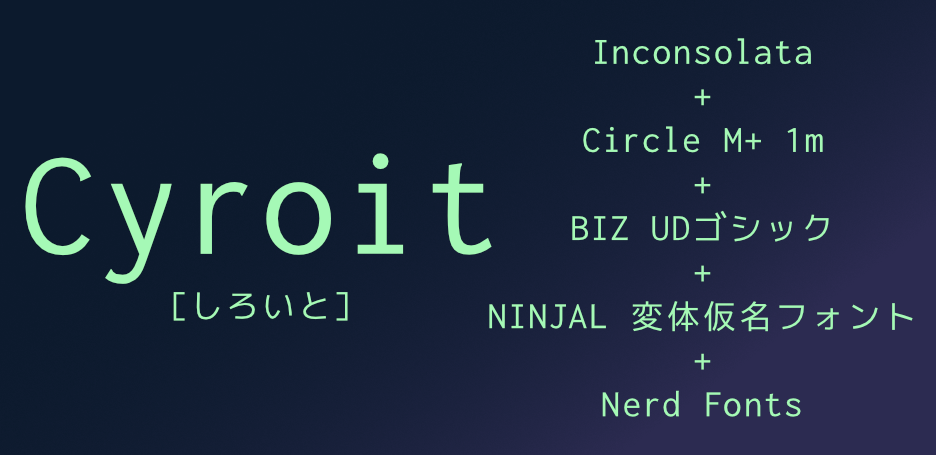
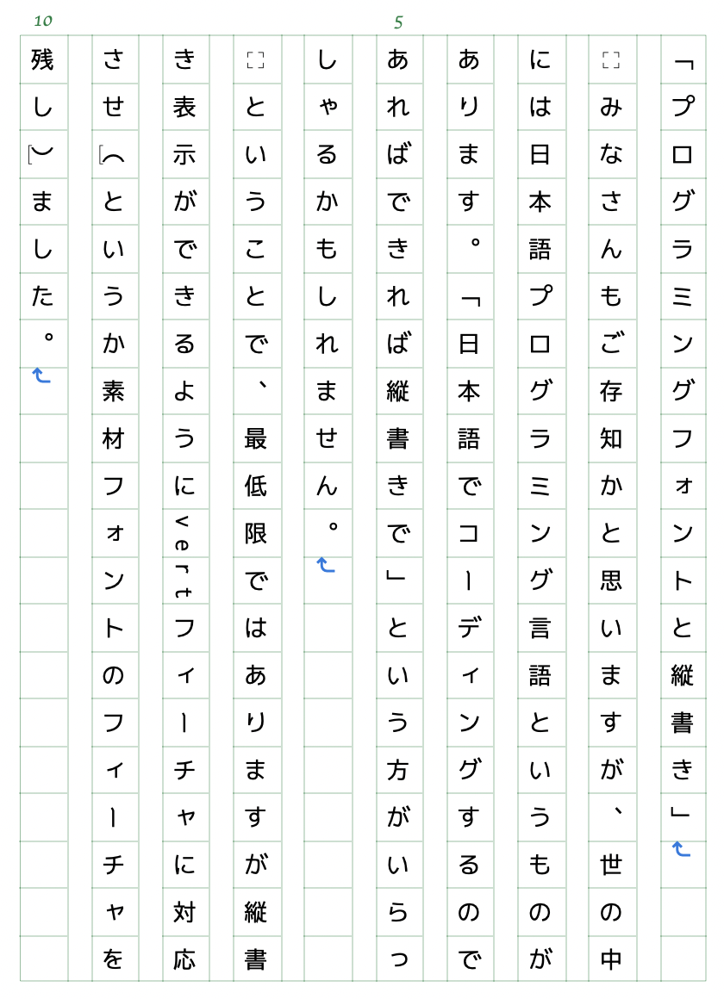
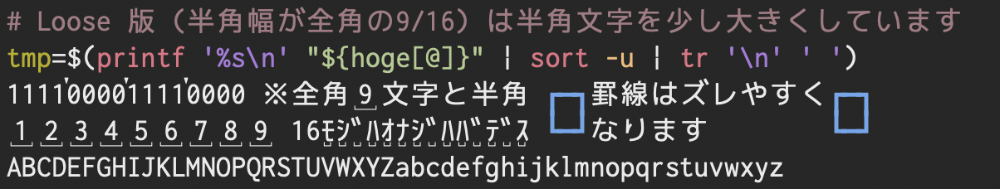
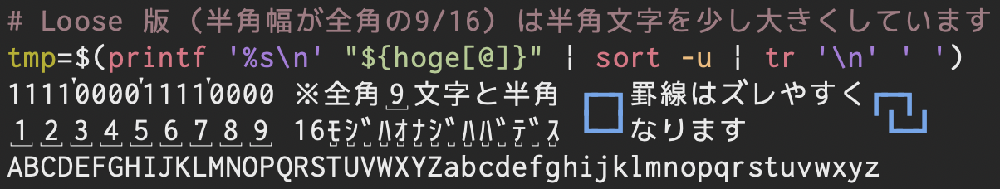
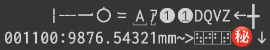
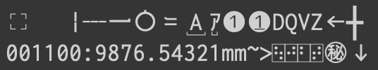
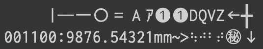
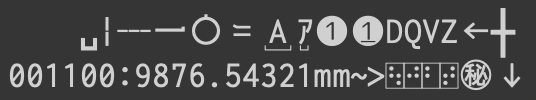

# 全角英数や半角カナが判別しやすい、文字間隔調整機能付き等幅フォント「Cyroit」

Cyroit (しろいと) はコーディングにもお使いいただける日本語等幅フォントです。  
プログラミング向け合成フォントとして評価の高い [Ricty](https://rictyfonts.github.io) の生成スクリプトで遊んでいるうちに、フォント製作の沼にはまってしまったことで誕生しました。

全角英数記号や半角カナ等にアンダーラインが引いてあるため、全角・半角の組み合わせになっている括弧や、誤って使われている全角チルダなどをすぐに見つけることができます。  
全角スペースや半角・ノーブレークスペースを可視化したバージョンも用意してあり、使い分けて使用できます。

フォント生成用のスクリプトを利用すれば、必要な機能のみ実装したフォントをご自身で作っていただくこともできます。

- [Commit Mono](https://commitmono.com) に影響を受け、calt を利用したカーニング機能を実装しました (v1.1.0以降)。
- [mottainaiDTP](http://mottainaidtp.seesaa.net) さんの [3桁ごとにカンマが発生するフォント](http://mottainaidtp.seesaa.net/article/395328634.html) を応用し、桁区切りマークを表示するバージョンを追加しました (v1.6.0以降)。
- スタイルセットに対応したことで、機能や見た目について柔軟にカスタマイズできるようになりました (v2.0.0以降)。
- 変体仮名と小書き仮名拡張の表示に対応しました (v2.1.0以降)。
- 点字の表示に対応しました (v2.4.0以降)。
- 英数文字の間隔にゆとりを持たせるために、半角と全角の横幅の比率を9:16にしたバージョンを追加しました (v3.0.0以降)。
- カラー絵文字フォントとの併用を前提に、絵文字のグリフを減らしたバージョンを追加しました (v3.2.0以降)。
- Cyroit に [Meslo LG](https://github.com/andreberg/Meslo-Font) と [Hack](https://sourcefoundry.org/hack/) を合成した姉妹フォント「[Meroit](https://omonomo.github.io/Meroit/)」を作成しました (v3.2.6以降を使用)。
- Cyroit に [JetBrains Mono](https://www.jetbrains.com/ja-jp/lp/mono/) を合成した姉妹フォント「[Jeroit](https://omonomo.github.io/Jeroit/)」を作成しました (v3.3.0以降を使用)。
- Cyroit に [Ubuntu Mono](https://design.ubuntu.com/font) を合成した姉妹フォント「[Ubroit](https://omonomo.github.io/Ubroit/)」を作成しました (v3.3.0以降を使用)。
- Cyroit に [Source Code Pro](https://adobe-fonts.github.io/source-code-pro/) と [Hasklig](https://github.com/i-tu/Hasklig) を合成した姉妹フォント「[Soroit](https://omonomo.github.io/Soroit/)」を作成しました (v3.4.2以降を使用)。
- Cyroit に [Roboto Mono](https://fonts.google.com/specimen/Roboto+Mono) と [Noto Sans Mono](https://fonts.google.com/noto/specimen/Noto+Sans+Mono) を合成した姉妹フォント「[Roroit](https://omonomo.github.io/Roroit/)」を作成しました (v3.5.0以降を使用)。
- Cyroit に [Victor Mono](https://rubjo.github.io/victor-mono/) を合成した姉妹フォント「[Viroit](https://omonomo.github.io/Viroit/)」を作成しました (v3.5.1以降を使用)。
- Cyroit に [Monoid](https://larsenwork.com/monoid/) を合成した姉妹フォント「[Idroit](https://omonomo.github.io/Idroit/)」を作成しました (v3.5.1以降を使用)。
- 私用領域以外の中立・曖昧幅の文字を半角にしたターミナル版を追加しました (v3.7.0以降)。

## フォントサンプル

[CotEditor](https://coteditor.com) にて  


[warp](https://www.warp.dev) + [Starship](https://starship.rs/ja-JP/) + [lsd](https://github.com/lsd-rs/lsd) にて  


[egword Universal2](https://www.monokakido.jp/ja/mac/egworduniversal2/) にて  


カーニングサンプル  


桁区切り表示サンプル  


半角幅の違いサンプル (上: 1/2、下: 9/16)  
<br>


追加した記号等のコードポイント  


## ダウンロード

最新版 v3.7.2 (2025-12-12)

| リンク                                                                                                      | 説明                                            |
| ----------------------------------------------------------------------------------------------------------- | ----------------------------------------------- |
| [フォント (Cyroit)](https://github.com/omonomo/Cyroit/releases/download/v3.7.2/Cyroit_v3.7.2.zip)           | 通常版。半角幅が全角の1/2。                     |
| [フォント (CyroitLoose)](https://github.com/omonomo/Cyroit/releases/download/v3.7.2/CyroitLoose_v3.7.2.zip) | 文字間隔ゆるい版。半角幅が全角の9/16。          |
| [ソースコード](https://github.com/omonomo/Cyroit/archive/refs/tags/v3.7.2.zip)                              | 使用方法は[下の方](#基本的な使い方)にあります。 |

フォントやスクリプトの使用は自己責任にてお願いいたします。  
各ファイルを使用することで生じた不具合・損害等について omonomo は責任を負いません。  
[ライセンス](#ライセンス)に従ってのご使用をお願いいたします。

過去のバージョンや更新履歴は[こちら](https://github.com/omonomo/Cyroit/releases)をご参照ください。

## その他の特徴

- 主にラテン文字のグリフは [Inconsolata](https://levien.com/type/myfonts/inconsolata.html) を使用しています。
- 主に仮名文字、ギリシア文字、キリル文字のグリフは [Circle M+ 1m](https://itouhiro.github.io/mixfont-mplus-ipa/) を使用しています。
- 主に漢字のグリフは [BIZ UDゴシック](https://github.com/googlefonts/morisawa-biz-ud-gothic) を使用しています。
- 主に変体仮名のグリフは [NINJAL 変体仮名フォント](https://cid.ninjal.ac.jp/kana/font/) を使用しています。
- [Nerd Fonts](https://www.nerdfonts.com) を追加しています。
- [ricty_generator](https://rictyfonts.github.io) を Fork したスクリプトで自動生成させています。
- フォント生成時にグリフの改変や調整、追加を行っています。新規追加分も含め、全てのグリフは素材フォントの組み合わせだけで作られています。

### ラテン文字について

- 小文字の g をオープンテールに改変しています。
- アスタリスクのスポークを6本に増やしています。
- チルダの波が強調されています。
- 数字の7の先端を折り曲げています。
- その他のグリフについても、視認性向上や他の素材フォントとのバランスをとるため等の微調整を施しています。

### 仮名文字について

- 一部のひらがなを教科書体っぽく改変 (跳ねたり突き抜けたり別れたり) しています。
- 濁点、半濁点の大きさや位置を変更しています。
- イコールと区別しやすいようにダブルハイフンの先端を少し折っています。
- その他のグリフについても、他の素材フォントとのバランスをとるため等の微調整を施しています。
- 小書き仮名拡張に対応しています。また見た目に統一感はないですが、変体仮名の表示にも対応しています。

### 漢字について

- カタカナや図形の○などと区別しやすいように一部の漢字にウロコを追加しています。
- いわゆる土吉 (吉の異体字) を追加しています。
- その他のグリフについても、他の素材フォントとのバランスをとるための微調整を施しています。

### 記号類について

- ダッシュや縦棒など、形状の似た記号と区別しやすいように実線を破線に改変している記号があります。
- 点字や漢字構成記述文字、キーボードショートカット、製図記号などを少し追加しています。
- Nerd Fonts は他の素材フォントとのバランスをとるために、一部を除いてサイズを調整しています。
- また Nerd Fonts には、Ver.3.3.0 から [Fira Code](https://github.com/tonsky/FiraCode) 由来の[プログレスバー](https://github.com/tonsky/FiraCode/blob/master/extras/progress.png)のグリフが加わっていますが、独自に製作したグリフに置き換えています。

### 機能的なものについて

- IVS を利用した漢字の異体字表示に対応しています。
- ccmp によるアイヌ語カナ表記に対応しています。
- vert のみですが、縦書き表示に対応しています。
- calt を利用して、等幅のままでラテン文字 (一部除く) の文字間隔を調整するようにしています。
- 同じく calt を利用して整数に桁区切りマークを表示させています。また桁区切り表示版は小数が少し小さく表示されます。
- 桁区切りマークは、上の表示が4桁区切り (36桁まで)、下の表示が3桁区切り (39桁まで) です。4桁区切りは0と1が続いた時のみ表示されます。
- 一部のバージョンに限りますが、各 ss を有効にすることで機能や見た目をカスタマイズすることができます。
- 記号を置き換えるタイプのリガチャには対応していません。
- 素材元のフォントにあった GSUB、GPOS のフィーチャは大幅に削ってあります。

### Loose (文字間隔ゆるい) 版について

- Cyroit は全角幅の値を1024に設定してあります。Loose 版は半角幅を半分の512ではなく、576に設定しました。
- 全角幅と半角幅の最小公倍数は9216になるため、理論上は全角9文字と半角16文字でちょうど同じ幅になります。
- 実際は環境や文字の大きさ等の条件によって誤差が生じ、表示がずれることがあります。
- 拡がった文字間隔に合わせて半角英数文字の大きさや縦横比を調整しています。

## 収録フォントの違い

見た目が少し違うだけなのに種類を増やしたため、無駄にファイルサイズが大きくなってしまい大変申しわけございません。  
それぞれにレギュラー、オブリーク、ボールド、ボールドオブリークの書体が含まれています。  
Loose 版は名称が 「CyroitLoose...」 になります。

| 名称      | サンプル                                                 | 説明                                                                                                                    |
| --------- | -------------------------------------------------------- | ----------------------------------------------------------------------------------------------------------------------- |
| Cyroit    |  | 通常版。スタイルセット対応。<br> 内容については後述。                                                                   |
| Cyroit EH |          | 絵文字減らした版。スタイルセット対応。別の絵文字フォントとの併用推奨。<br>(サンプルの㊙は Apple Color Emoji のものです) |
| Cyroit BS |          | 基本版。Ver.1.x.x までの通常版。<br> 全角スペースを可視化しています。                                                   |
| Cyroit SP |          | スペシャルスペース版。<br> 半角スペース、ノーブレークスペースも可視化したバージョン。                                   |
| Cyroit DG |          | 桁区切り表示版。<br> たくさん並んだ数字とにらめっこする時間を短縮できます。                                             |
| Cyroit FX |          | 文字間隔固定版。calt と相性が悪いソフト用。<br> また他のバージョンよりも軽快に動作します。                              |
| Cyroit HB |          | 平凡版。全てのスペースが不可視でグリフ改変も抑えたバージョン。<br> プリントアウト用にどうぞ。                           |
| Cyroit TM |          | ターミナル版。<br>私用領域以外の中立・曖昧幅の文字を半角にしたバージョン。                                              |

### 通常版、絵文字減らした版のスタイルセットについて

設定方法については、[Fira Code の説明](https://github.com/tonsky/FiraCode/wiki/How-to-enable-stylistic-sets)が分かりやすいと思います。

| タグ名 | サンプル                                             | 内容                                                                                        |
| ------ | ---------------------------------------------------- | ------------------------------------------------------------------------------------------- |
| ss01   |  | 全角スペース可視化                                                                          |
| ss02   |  | 半角スペース可視化                                                                          |
| ss03   |  | 3桁区切りマーク表示                                                                         |
| ss04   |  | 4桁区切りマーク表示                                                                         |
| ss05   |  | 小数小文字化                                                                                |
| ss06   |  | 全角・半角形の下線、点字の外枠消去                                                          |
| ss07   |  | 識別性向上グリフ無効                                                                        |
| ss08   |  | DQVZ のグリフ変更                                                                           |
| ss09   |  | JIS に含まれる罫線を全角化、矢印を細線化<br> (環境によって全角にならないことがあります)     |
| ss10   |  | 0のスラッシュ消去                                                                           |
| ss11   |  | ss01、ss02で表示される以外のスペース可視化<br> (環境によって可視化されないことがあります)   |
| ss12   |  | ファイル名に使われがちな曖昧幅の文字を半角化<br> (環境によって半角にならないことがあります) |
| ss13   |  | バックスラッシュ細線化<br> (2つ並んだ場合、右側は通常の太さになります)                      |

## ライセンス

- フォント : [SIL Open Font License 1.1](https://github.com/omonomo/Cyroit/blob/main/build/Cyroit/OFL.txt)
- スクリプト : [The MIT License](https://github.com/omonomo/Cyroit/blob/main/LICENSE.txt)

素材元のフォントやスクリプトはライセンスが異なる場合があります。

## 生成スクリプトの使い方

### ビルド環境

Cyroit は以下の環境でビルドできることを確認しています。

- macOS Tahoe 26.1
- GNU bash, version 5.3.8(1)-release (aarch64-apple-darwin25.1.0)
- FontForge 20251009
- FontTools 4.61.0

または上記 macOS 上にて

- Docker Desktop 4.53.0 (Engine 29.0.1, Compose v2.40.3-desktop.1)
  - Ubuntu 24.04.3 LTS
  - GNU bash, version 5.2.21(1)-release (aarch64-unknown-linux-gnu)
  - FontForge 20230101
  - FontTooles 4.46.0

### 基本的な使い方

#### 1. [Docker (および Docker Compose)](https://www.docker.com) を使用する場合

スクリプトのある場所をカレントディレクトリにして

```
docker compose run --rm font ./run_ff_ttx.sh -F S
```

異常なく完了した場合、直下の `build` フォルダに通常版のフォントが保存されます。

- Docker 内に「fontcaches」「karningcaches」という名前を含むボリュームが作成されますのでご注意ください。
- 「fontcaches」「karningcaches」には、コマンドを複数回実行する際にビルド時間を短縮するためのキャッシュファイルが保存されます。
- ソースコードに変更があった場合は先に `docker compose build` を実行してください。

#### 2. Docker を使用しない場合

あらかじめパッケージマネージャ等を利用して [FontForge](https://fontforge.org/en-US/) と [FontTools](https://github.com/fonttools/fonttools) をインストールし、使える状態にしておいてください。

スクリプトのある場所をカレントディレクトリにして

```
./run_ff_ttx.sh -F S
```

異常なく完了した場合、直下の `build` フォルダに通常版のフォントが保存されます。

### 各スクリプトの説明

Cyroit の生成には、主に5つの Shell スクリプトと1つの設定ファイルを使用します。

#### 1. `run_ff_ttx.sh`

一連の処理を自動化します。全スクリプトの中のリーダーです。  
`-F` オプションを付けずに生成したフォントは、表示確認用の未完成品になります。  
パラメータとして引数に font_generator のオプション (`hVxXfNn` 以外) をハイフン無しで羅列することにより、生成フォントをカスタマイズすることができます。

(例) 接尾語に「NoNF」を付けて、Nerd Fonts 抜きの基本版 (完成品) を生成する場合

```
./run_ff_ttx.sh -F -n "NoNF" ztse
```

- オプション  
  `-h` ヘルプを表示します。  
  `-x` スクリプトと同じフォルダにあるフォントと一時作成ファイルの削除のみ行って終了します。  
  `-X` スクリプトと同じフォルダにあるフォントと一時作成ファイル、保存してあるキャッシュファイルの削除のみ行って終了します。  
  `-l` 一時作成ファイルを残したままにします。`-d` `-C` `-p` の場合、`-l` に関係なく一時作成ファイルを残します。  
  `-N string` フォントファミリー名を _string_ にします。省略すると「Cyroit」になります。  
  `-n string` フォントファミリー名の接尾語 (「BS」や「SP」の部分) を _string_ にします。  
  `-w` 生成フォントを Loose 版にします。  
  `-k` calt 作成時にカーニング以外の設定 (桁区切り、記号の移動) のみ作成します。  
  &emsp; &emsp; 生成されるフォントは文字間隔を調整しませんが、動作が軽くなります。  
  `-r` cmap や calt 用のテーブルファイルがすでに存在していた場合、作り直さずにそのファイルを使用します。  
  `-d` 下書きモード。時間のかかる処理を飛ばします。改変したグリフの確認用です。  
  &emsp; &emsp; フォント情報を書き換える前に終了します。パラメータ無しの場合 `ldoP` を有効にしたフォントを生成します。  
  `-C` calt を設定する直前で処理を終了します。パラメータ無しの場合 `lSeo` を有効にしたフォントを生成します。  
  `-p` `-C` オプションの続きから実行します。元のフォントを残すので、調整を繰り返す時に重宝します。  
  &emsp; &emsp;カーニング設定は基本ラテン文字限定になります。フォントは合成済みのため、パラメータの内容は意味を成しません。  
  `-F` 完成品を生成します。時間がかかりますので気長にお待ちください。完成したフォントは `build` フォルダに保存されます。  
  &emsp; &emsp;カーニング設定はラテン文字拡張 A までになります。  
  &emsp; &emsp;・パラメータ有りの場合、パラメータに応じたフォントのみ生成します。  
  &emsp; &emsp;・パラメータ無し、`-n` 有りの場合、スタイルセットに対応した (`S` を有効にした) フォントのみ生成します。  
  &emsp; &emsp;・パラメータ無し、`-n` 無しの場合、デフォルトの全てのバージョンから絵文字減らした版、ターミナル版以外を生成します。  
  `オプション無し`  
  &emsp; &emsp;カーニング設定は基本ラテン文字限定になります。パラメータ無しの場合 `lo` を有効にしたフォントを生成します。

#### 2. `font_generator.sh`

通常、直接実行する必要はありません。  
FontForge のスクリプト機能を利用してフォントの合成とグリフの改変を行います。  
オプションを指定することでフォントの見た目や機能を変更することができます。  
オプションの最後に素材にするフォントのファイル名を指定する必要がありますが、基本的に `auto` で問題ありません。  
合成したフォントを完成させるには、table_modificator を実行してフォント情報を書き換える必要があります。
合成途中のフォントファイルはキャッシュされます。font_generator.sh や settings.txt を更新した場合は始めから作り直します。

(例) 下書きモードで平凡版を生成する場合

```
./font_generator.sh -dZzubts auto
```

- オプション  
  `-h` ヘルプを表示します。  
  `-V` 生成するフォントのバージョンナンバーを表示します。`settings.txt` の内容を参照します。  
  `-x` スクリプトと同じフォルダにある一時作成ファイルの削除のみ行って終了します。  
  `-X` スクリプトと同じフォルダにある一時作成ファイルとキャッシュファイルの削除のみ行って終了します。  
  `-f /path/to/fontforge` _/path/to/fontforge_ に存在する FontForge を使用します。  
  `-v` 合成時の経過を詳しく表示します。  
  `-l` 一時作成ファイルを残したままにします。  
  `-N string` フォントファミリー名を _string_ にします。省略すると「Cyroit」になります。  
  `-n string` フォントファミリー名の接尾語 (「BS」や「SP」の部分) を _string_ にします。  
  `-w` 合成フォントを Loose 版にします。  
  `-a` 私用領域以外の中立・曖昧な幅の文字を半角にします。  
  `-Z` 全角スペースを可視化しません。  
  `-z` 半角スペースを可視化しません。  
  `-u` 全角・半角形に下線を付けません。また点字に外枠を付けません。  
  `-b` 識別性を向上させるためのグリフ改変をしません。  
  `-t` D Q V Z のグリフを変更 (ストローク等を追加) しません。  
  `-O` 数字の0にスラッシュを付けません。  
  `-s` 桁区切りマークを表示させません。  
  `-c` calt に対応させません。文字間隔を調整しないフォントになります。`-s` も有効にしたことになります。  
  `-e` Nerd Fonts を追加しません。また Nerd Fonts を利用して作成・改変されたグリフも追加されません。  
  `-o` オブリーク体を生成しません。  
  `-j` 絵文字のグリフを減らします。  
  `-S` ss 対応のフォントにします。自動的に `-Zzts` が有効、`-ubOc` が無効になります。  
  `-d` 下書きモードで合成します。時間のかかる処理を飛ばしますが、完成品と見た目が少し異なる文字があります。  
  &emsp; &emsp;`-o` も有効になります。改変したグリフの確認用です。  
  `-P` font_generator は一旦全ての機能を実装した後にオプションに従って機能を削っていきますが、その直前で処理を終了します。  
  &emsp; &emsp;そのため一部のオプションは指定しても有効になりません。合成フォントの拡張子は `.nopatch.ttf` になります。  
  `-p` `-P` オプションの続きから実行します。

#### 3. `table_modificator.sh`

通常、直接実行する必要はありません。  
font_generator で合成したフォントの情報を FontTools の ttx コマンドを使用して書き換えます。  
またカーニングや桁区切り表示等の設定ファイルを作成して登録します。  
とりあえずオプション無し、もしくは `-o` のみ付けて実行すれば必要な情報を書き換えてフォントを完成させてくれます。  
`-r` を付けていないか必要なテーブルファイルが存在しない場合、スクリプト内で uvs_table_maker と calt_table_maker を実行します。

- オプション  
  `-h` ヘルプを表示します。  
  `-x` スクリプトと同じフォルダにある一時作成ファイルの削除のみ行って終了します。  
  `-l` 一時作成ファイルを残したままにします。  
  `-N string` ファミリー名が _string_ のフォントを処理します。省略すると「Cyroit」になります。  
  `-k` calt 作成時にカーニング以外の設定 (桁区切り、記号の移動) のみ作成します。  
  &emsp; &emsp;生成されるフォントは文字間隔を調整しませんが動作が軽くなります。  
  `-b` calt 作成時のカーニング設定を基本ラテン文字に限定します。表示確認用です。  
  `-o` カーニング作成時になんちゃって最適化処理を実行します。重複している設定を削除することで生成フォントを心持ち軽量化させます。  
  `-r` cmap や calt 用のテーブルファイルがすでに存在していた場合、作り直さずにそのファイルを使用します。  
  `-m` cmap を書き換えません。  
  `-g` GSUB (calt を含む) を書き換えません。  
  `-t` その他のテーブル (head、OS/2、post、hhea、htmx) を書き換えません。  
  `-C` calt を書き換える直前で処理を終了します。  
  `-p` `-C` オプションの続きから実行します。

#### 4. `uvs_table_maker.sh`

通常、直接実行する必要はありません。  
フォント合成時に失われた IVS 関連の cmap テーブルを作り直します。  
作成したデータは table_modificator で使用します。

- オプション  
  `-h` ヘルプを表示します。  
  `-x` スクリプトと同じフォルダにある一時作成ファイルの削除のみ行って終了します。  
  `-l` 一時作成ファイルを残したままにします。  
  `-N string` 名前が _string_-Regular のフォントに対するテーブルを作成します。  
  &emsp; &emsp;省略すると「Cyroit-Regular」が対象になります。

#### 5. `calt_table_maker.sh`

通常、直接実行する必要はありません。  
calt テーブル (前後の文字によってグリフ置換を行う設定) を作成します。作成したデータは table_modificator で使用します。  
作成したファイルはキャッシュされます。calt_table_maker.sh を更新した場合やフォントのグリフ数の変更があるとテーブルを作り直します。

- オプション  
  `-h` ヘルプを表示します。  
  `-x` スクリプトと同じフォルダにある一時作成ファイルの削除のみ行って終了します。  
  `-X` スクリプトと同じフォルダにある一時作成ファイルとキャッシュファイルの削除のみ行って終了します。  
  `-l` 一時作成ファイルを残したままにします。  
  `-n number` calt で置換する先頭のグリフ (左に動いた A になります) を示す番号に _number_ を指定します。  
  &emsp; &emsp;先に uvs_table_maker を実行し、`gsubList.txt` が生成されていれば省略しても問題ありません。  
  `-k` カーニング以外の設定 (桁区切り、記号の移動) のみ作成します。  
  `-b` カーニング設定を基本ラテン文字に限定します。表示確認用です。  
  `-O` カーニング設定作成時に、全ての設定についてなんちゃって最適化処理を実行します。  
  &emsp; &emsp;重複している設定を削除することで生成フォントを心持ち軽量化させます。  
  `-o` カーニング設定作成時に、任意の設定 (ソースコードにて指定) に限りなんちゃって最適化処理を実行します。  
  &emsp; &emsp;最適化の効果がない設定をスキップするため、ビルド時間が若干短縮されます。

#### 6. `settings.txt`

生成フォントのバージョン番号やラテン文字の拡大・縮小率、カーニングの移動量などが記述されています。  
テキストを変更することで、スクリプトを直接編集せずに一部の設定を調整することができます。

## メモ

- 使用するソフトウェアによって縦書きや異体字、桁区切りマークが正しく表示されない、また文字間隔が調整されないことがあります。
- 「前後関係に依存する字形」や「リガチャ」などの設定項目がある場合、それを有効にすることで桁区切りマークや文字間隔調整機能が働く場合があります。
- 一部グリフに不統一なところがありますが、複数のフォントを合成しているためであり、仕様となります。
- 行間を広めにとっています。ダイアクリティカルマークがたくさん付いた文字もきちんと表示させるためです。
- メイン表示に文字間隔調整機能付きのフォントを指定すると、動作がもっさりになってしまうソフトウェアがあります。その場合は文字間隔固定版をお試しください。
- Loose 版は半角幅が全角の1/2ではありませんが、属性は等幅フォントとしています。使用される方にとってはそのほうが分かりやすいと判断したためです。
- スクリプト実行時、ttx にて「Attempting to fix OTLOffsetOverflowError…」という警告が出る場合がありますが、生成フォントに影響は無いと認識しております。

## リンク

- [GitHub リリースページ](https://github.com/omonomo/Cyroit/releases): 過去のバージョンや更新履歴はこちらをご参照ください。
- [全角英数や半角カナが判別しやすい、文字間隔調整機能付き等幅フォント「Meroit」](https://omonomo.github.io/Meroit/): 一つ下の妹さんフォントです。
- [全角英数や半角カナが判別しやすい、文字間隔調整機能付き等幅フォント「Jeroit」](https://omonomo.github.io/Jeroit/): 三番目の妹さんフォントです。
- [全角英数や半角カナが判別しやすい、文字間隔調整機能付き等幅フォント「Ubroit」](https://omonomo.github.io/Ubroit/): 四番目の妹さんフォントです。
- [全角英数や半角カナが判別しやすい、文字間隔調整機能付き等幅フォント「Soroit」](https://omonomo.github.io/Soroit/): 五番目の妹さんフォントです。
- [全角英数や半角カナが判別しやすい、文字間隔調整機能付き等幅フォント「Roroit」](https://omonomo.github.io/Roroit/): 六番目の妹さんフォントです。
- [全角英数や半角カナが判別しやすい、文字間隔調整機能付き等幅フォント「Viroit」](https://omonomo.github.io/Viroit/): 七番目の妹さんフォントです。
- [全角英数や半角カナが判別しやすい、文字間隔調整機能付き等幅フォント「Idroit」](https://omonomo.github.io/Idroit/): 末っ子の妹さんフォントです。
