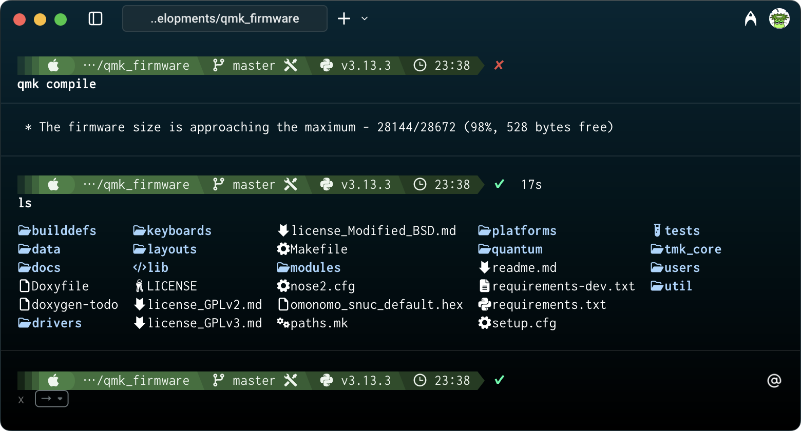

# 全角英数や半角カナが判別しやすい、文字間隔調整機能付き等幅フォント「Cyroit」

Cyroit (しろいと) はプログラミングにもお使いいただける等幅フォントです。  
Ricty 生成スクリプトで遊んでいるうちに合成フォント製作の沼にはまったことで生まれました。  
全角英数記号や半角カナ等にアンダーラインが引いてあるため、括弧が全角と半角の組み合わせになっていたり、波ダッシュであるべきところに全角チルダが使われていたりしてもすぐに判別することができます。  
全角スペースを可視化しており、さらに半角・ノーブレークスペースも可視化したバージョンも用意しています。  
[Commit Mono](https://commitmono.com) に影響を受け、calt フィーチャを利用したカーニング機能を実装しました (v1.1.0以降)。  

## フォントサンプル  

[CotEditor](https://coteditor.com) にて  
  

[warp](https://www.warp.dev) + [Starship](https://starship.rs/ja-JP/) + [lsd](https://github.com/lsd-rs/lsd) にて  
  

[egword Universal2](https://www.monokakido.jp/ja/mac/egworduniversal2/) にて  
  

カーニングサンプル  
  

## ダウンロード

最新版 (v1.5.3)
- [フォント](https://github.com/omonomo/Cyroit/releases/download/v1.5.3/Cyroit_v1.5.3.zip)
- [ソースコード](https://github.com/omonomo/Cyroit/archive/refs/tags/v1.5.3.zip)

フォントファイルの使用は自己責任にてお願いいたします。  
ファイルを使用することで生じた不具合・損害等について omonomo は責任を負いません。  

## その他の特徴

- 主にラテン文字のグリフは [Inconsolata](https://github.com/googlefonts/Inconsolata) を使用しています。
- 主に仮名文字、ギリシア文字、キリル文字のグリフは [CircleM+ 1m](https://mix-mplus-ipa.osdn.jp) を使用しています。
- 主に漢字のグリフは [BIZ UDゴシック](https://github.com/googlefonts/morisawa-biz-ud-gothic) を使用しています。
- [Nerd Fonts](https://www.nerdfonts.com) Ver.3 を追加しています。
- [ricty_generator](https://rictyfonts.github.io) をForkしたスクリプトで自動生成させています。生成時にグリフの改変や微調整を行っています。

### ラテン文字について

- 小文字の g をオープンテールに改変しています。
- アスタリスクのスポークを6本に増やしています。
- チルダの波が強調されています。
- 数字の7の先端を折り曲げています。
- その他のグリフについても、視認性向上や他の素材フォントとのバランスをとるための微調整を施しています。

### 仮名文字について

- 一部のひらがなを教科書体っぽく (跳ねたり突き抜けたり別れたり) しています。
- 濁点、半濁点の大きさや位置を変更しています。
- イコールと区別しやすいようにダブルハイフンの先端を少し折っています。
- その他のグリフについても、他の素材フォントとのバランスをとるための微調整を施しています。

### 漢字について

- カタカナや図形の○などと区別しやすいように一部の漢字にウロコを追加しています。
- いわゆる土吉 (吉の異体字) を追加しています。
- その他のグリフについても、他の素材フォントとのバランスをとるための微調整を施しています。

### 記号類について

- 形状の似た記号と区別しやすいように破線に改変している記号があります。
- キーボードショートカット用などの記号を少しだけ追加しています。

### 機能的なものについて

- IVS を利用した異体字表示に対応しています。
- アイヌ語カナ表記に対応しています。
- vert フィーチャのみですが、縦書き表示に対応しています。
- calt フィーチャを利用して、等幅のままでラテン文字 (一部除く) の文字間隔を調整するようにしています。
- リガチャには対応していません。
- 素材元のフォントにあった GSUB、GPOS のフィーチャは大幅に削っています。

## フォントファミリーの種類

見た目がちょっと違うだけなのに種類を増やしたため、無駄にファイルサイズが大きくなってしまい大変申しわけございません。  
それぞれにレギュラー、オブリーク、ボールド、ボールドオブリークの書体が含まれています。  

|   名称   | サンプル | 説明 |
|----------|----------|------|
| Cyroit   |  | 通常版。全角スペースを可視化し、全角形・半角形や濁点・半濁点、感嘆符等にアンダーラインが付くなど、形の似た文字を識別しやくしています。 |
| CyroitSP |  | スペシャルスペース版。半角スペース、ノーブレークスペース (0x00a0) も可視化したバージョン。コマンドランチャー等で使用すると便利かもしれません。 |
| CyroitTM |  | トゥーマッチ (やりすぎ) 版。開発途中まで通常版だったバージョンを復活。大文字の DVZ のグリフを改変しています。 |
| CyroitTS |  | トゥーマッチスペシャルスペース版。トゥーマッチなスペシャルスペース版。 |
| CyroitFX |  | 文字間隔固定版。calt フィーチャと相性が悪いソフト用。 |
| CyroitHB |  | 平凡版。全てのスペースが不可視でグリフ改変も抑えたバージョン。プリントアウト用にどうぞ。 |

## ライセンス

- フォントのライセンス : [SIL Open Font License 1.1](build/OFL.txt)
- スクリプトのライセンス : [MIT](./LICENSE.txt)

素材元のフォントやスクリプトはライセンスが異なる場合があります。  

## 生成スクリプトの使い方

### ビルド環境

Cyroit は、以下の環境でビルドできることを確認しています。  

- OS: macOS Sonoma (version 14.1.1)
- Shell: zsh 5.9 (x86_64-apple-darwin23.0)
- FontForge: 20230101
- FontTools: 4.44.3

### 実行方法

あらかじめ、パッケージマネージャ等を利用して [FontForge](https://fontforge.org/en-US/) と [FontTools](https://github.com/fonttools/fonttools) をインストールし、使える状態にしておいてください。  

スクリプトのある場所をカレントディレクトリにして  
```
./run_ff_ttx.sh -F
```
異常なく完了した場合、直下の build フォルダにフォントが保存されます。  

フォントをあれこれしたい人は以下のオプションが役に立つかもしれません。  

`-h` ヘルプを表示します。  
`-d` 下書きモード。時間のかかる処理を飛ばします。改変したグリフを確認するのに便利です。  
`-C` calt フィーチャを設定する直前で処理を終了します。  
`-p` `-C`オプションの続きを実行します。元のフォントを残すので、カーニングの設定・確認を繰り返す時に重宝します。  
`-c` カーニング機能を除いたフォントを生成します。  
`-e` Nerd Fonts 無しのフォントを生成します。  
`-F` 完成品を生成します。全てのバージョンを生成しますので時間がかかります。気長にお待ちください。  

`-F`オプション以外の時は、グリフや機能に関係なくフォント名が Cyroit になり、オブリーク体を生成しません。  
オプションなしの場合、通常処理でカーニングあり、Nerd Fonts ありになります。  

## メモ

- 使用するソフトウェアによって、縦書きや異体字、アイヌ語カナ表記が正しく表示されない、また文字間隔が調整されない場合があります。
- 一部グリフが不統一なところがありますが、複数のフォントを合成しているためであり、仕様となります。
- 行間が広めにとってあります。ダイアクリティカルマークがたくさん付いた文字もきちんと表示させるためです。
- Powerline グリフを使用する際はフォントサイズを 12pt か 14pt にすると、よい感じに表示されるかもしれません。

## リンク

- [GitHubページ](https://github.com/omonomo/Cyroit): 過去のバージョンや更新履歴はこちらをご参照ください。
- [小指の移動量が少ない日本語かな入力配列 「水草配列」](https://omonomo.github.io/Mizukusa/): オリジナル日本語かな入力配列を紹介しています。
- [DefaultKeyBinding.dict サンプル](https://omonomo.github.io/DefaultKeyBinding/): タイトル通りです。